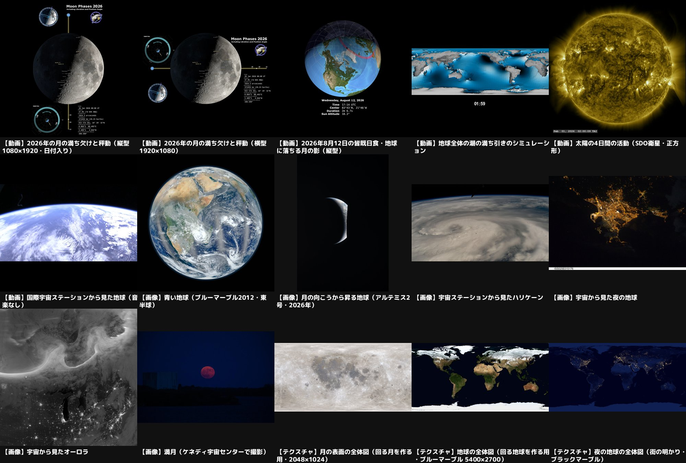

# フリー素材カタログ（NASA）

「もしも」動画などで使える、商用利用できるフリー素材の一覧です。`python3 scripts/download_footage.py` で `public/footage/` にダウンロードします（大きいので Git には含めません）。

## ライセンス

- NASA の画像・映像は原則として著作権がなく（パブリックドメイン）、YouTube の収益化動画にも使えます。
- 概要欄に「映像：NASA」などのクレジットを入れるのがおすすめです（表の「クレジット」）。
- NASA のロゴ（ミートボール）は使えません。NASA が動画を推薦・協力しているように見せる使い方も避けてください。
- 画像に人物が写っている場合は、その人の肖像に注意してください（この一覧の素材には写っていません）。

## 一覧

| ファイル | 種類 | 内容 | クレジット | 出典 |
| --- | --- | --- | --- | --- |
| `moon_phases_2026_vertical.mp4` | 動画 | 2026年の月の満ち欠けと秤動（縦型1080×1920・日付入り） | NASA's Scientific Visualization Studio | [Moon Phase and Libration, 2026](https://svs.gsfc.nasa.gov/5587/) |
| `moon_phases_2026_1080p.mp4` | 動画 | 2026年の月の満ち欠けと秤動（横型1920×1080） | NASA's Scientific Visualization Studio | [Moon Phase and Libration, 2026](https://svs.gsfc.nasa.gov/5587/) |
| `solar_eclipse_2026-08-12_vertical.mp4` | 動画 | 2026年8月12日の皆既日食・地球に落ちる月の影（縦型） | NASA's Scientific Visualization Studio | [Animations of the August 12, 2026, Total Solar Eclipse](https://svs.gsfc.nasa.gov/5656/) |
| `ocean_tides_1080p.mp4` | 動画 | 地球全体の潮の満ち引きのシミュレーション | NASA's Scientific Visualization Studio | [Barotropic Global Ocean Tides](https://svs.gsfc.nasa.gov/4821/) |
| `sun_sdo_171_1024.mp4` | 動画 | 太陽の4日間の活動（SDO衛星・正方形） | NASA/SDO | [Four Days of Solar Dynamics in 16 Minutes](https://svs.gsfc.nasa.gov/5649/) |
| `earth_views_iss.mp4` | 動画 | 国際宇宙ステーションから見た地球（音楽なし） | NASA | [Earth Views from the ISS - No Music](https://images.nasa.gov/details/NHQ_2020_1221_Earth%20Views) |
| `blue_marble_east.jpg` | 画像 | 青い地球（ブルーマーブル2012・東半球） | NASA | [Eastern Hemisphere - Blue Marble 2012](https://images.nasa.gov/details/GSFC_20171208_Archive_e001788) |
| `earthrise_artemis2.jpg` | 画像 | 月の向こうから昇る地球（アルテミス2号・2026年） | NASA | [Artemis Era Earthrise](https://images.nasa.gov/details/art002e009280b) |
| `hurricane_helene_iss.jpg` | 画像 | 宇宙ステーションから見たハリケーン | NASA | [Hurricane Helene pictured from the space station](https://images.nasa.gov/details/iss072e001649) |
| `earth_night_iss.jpg` | 画像 | 宇宙から見た夜の地球 | NASA | [Night view of Earth taken by the Expedition 25 crew](https://images.nasa.gov/details/iss025e015176) |
| `aurora_from_space.jpg` | 画像 | 宇宙から見たオーロラ | NASA | [Auroras over North America as Seen from Space](https://images.nasa.gov/details/GSFC_20171208_Archive_e001646) |
| `full_moon.jpg` | 画像 | 満月（ケネディ宇宙センターで撮影） | NASA/Ben Smegelsky | [Creative Photography - Full Blue Moon](https://images.nasa.gov/details/KSC-20240819-PH-JBS01_0009) |
| `moon_texture_2k.jpg` | テクスチャ | 月の表面の全体図（回る月を作る用・2048×1024） | NASA's Scientific Visualization Studio | [CGI Moon Kit](https://svs.gsfc.nasa.gov/4720/) |
| `earth_texture_5400.jpg` | テクスチャ | 地球の全体図（回る地球を作る用・ブルーマーブル 5400×2700） | NASA Earth Observatory | [Blue Marble Next Generation (December 2004)](https://visibleearth.nasa.gov/images/74218) |
| `earth_night_texture.jpg` | テクスチャ | 夜の地球の全体図（街の明かり・ブラックマーブル） | NASA Earth Observatory/NOAA NGDC | [Earth at Night (Black Marble 2012)](https://visibleearth.nasa.gov/images/79765) |
| `earth_spin_nightlights.mp4` | 動画 | 雲・大気・夜の街の明かりつきで回る地球（CG） | NASA's Scientific Visualization Studio | [Spinning Earth with clouds, atmosphere, and night lights](https://svs.gsfc.nasa.gov/5570/) |
| `solar_flare_m84.mp4` | 動画 | 太陽フレア（2025年6月15日・M8.4・SDO衛星） | NASA/SDO | [M8.4 flare from Active Region 14114 - June 15, 2025](https://svs.gsfc.nasa.gov/5560/) |
| `arctic_sea_ice_2026.mp4` | 動画 | 北極の海氷（2026年の最小面積まで） | NASA's Scientific Visualization Studio | [Arctic Sea Ice Minimum 2026](https://svs.gsfc.nasa.gov/5677/) |
| `iss_aurora_2025.mp4` | 動画 | 宇宙ステーションから見たオーロラ（2025年11月の磁気嵐） | NASA | [ISS views Aurora from the November 11-13, 2025 Geomagnetic Storm](https://svs.gsfc.nasa.gov/31375/) |
| `plants_glow.mp4` | 動画 | 植物の光合成を宇宙から観測するイメージ映像（OCO-3）（途中から人物インタビューなので、使うのは森の部分だけ） | NASA/JPL-Caltech | [NASA's OCO-3: Watching Plants Grow and Glow](https://images.nasa.gov/details/JPL-20190403-OCOf-0002-OCO3%20Watching%20Plants%20Grow%20and%20Glow%204K) |
| `frozen_lake_iss.jpg` | 画像 | 宇宙から見た凍った湖（モンゴル・フブスグル湖） | NASA | [The frozen Khuvsgul Lake in Mongolia](https://images.nasa.gov/details/iss074e0247458) |

## 使うときの注意

- 月の満ち欠けの動画（`moon_phases_*`）は日付や図が入っているので、月の部分を拡大・切り抜いて使います。
- `earth_views_iss.mp4` は44分あるので、必要な部分だけを切り出して使います。
- `earth_night_iss.jpg` は下に白い帯（撮影番号）があるので切り抜いて使います。
- テクスチャ（`*_texture*.jpg`）は球に貼り付けて、本物の写真の「回る地球・月」を作るための地図画像です。
